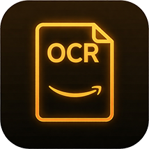
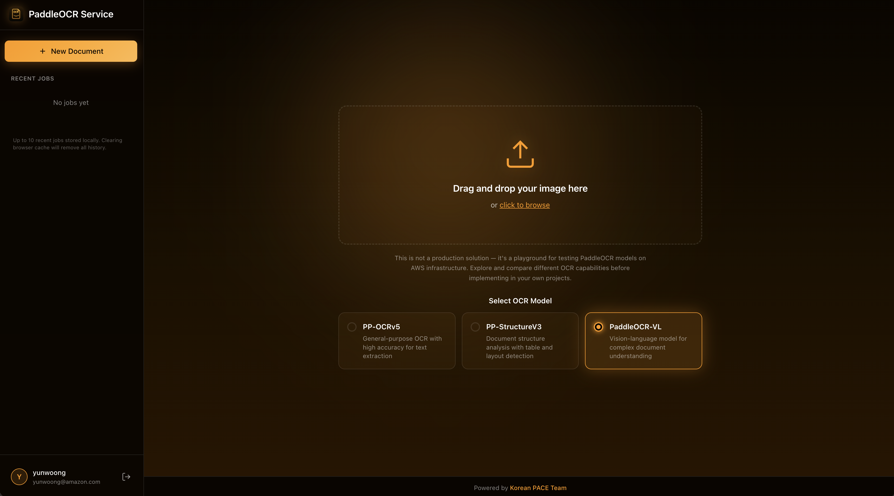
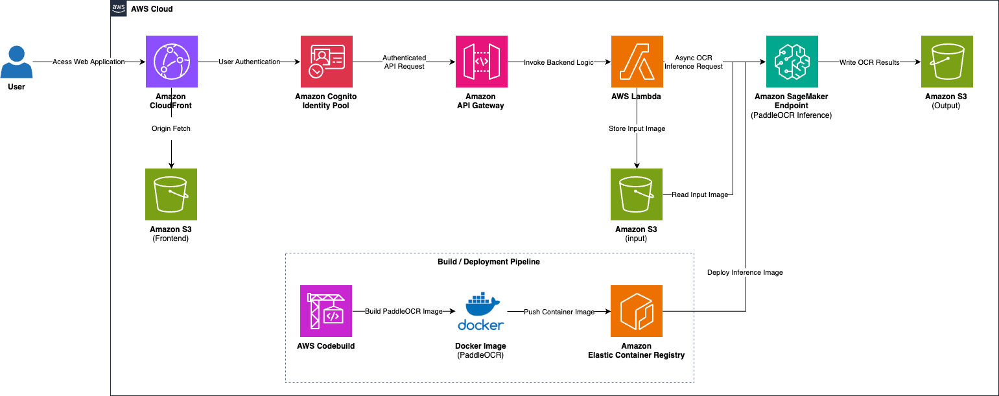

<p align="center">
  
</p>

<h1 align="center">OCR Vision Lab</h1>

<p align="center">
  <strong>A serverless OCR playground for testing PaddleOCR models on AWS infrastructure</strong>
</p>

<p align="center">
  
  
  
  
  
  
  
  
</p>

<p align="center">
  <strong>English</strong> | <a href="README_ko.md">한국어</a>
</p>

<p align="center">
  <a href="#features">Features</a> |
  <a href="#architecture">Architecture</a> |
  <a href="#getting-started">Getting Started</a> |
  <a href="#deployment">Deployment</a> |
  <a href="#supported-models">Models</a>
</p>

---

## Overview

OCR Vision Lab is a web-based playground for testing and experimenting with [PaddleOCR](https://github.com/PaddlePaddle/PaddleOCR) models on AWS infrastructure. It provides an intuitive interface to upload documents, select OCR models, and visualize extraction results with bounding box overlays.

> **Note**: This is not a production solution — it's a playground for testing PaddleOCR models on AWS infrastructure. Designed for experimentation, evaluation, and development purposes.



## Features

- **Multiple OCR Models**
  - **PP-OCRv5**: General-purpose OCR with high accuracy for text extraction
  - **PP-StructureV3**: Document structure analysis with table and layout detection
  - **PaddleOCR-VL**: Vision-language model for complex document understanding

- **Rich Language Support**: 80+ languages including Korean, English, Chinese, Japanese, and more

- **Interactive Result Viewer**
  - Zoom and pan controls for detailed inspection
  - Bounding box overlay visualization
  - Multiple output formats (Markdown, HTML, JSON, Blocks)

- **Serverless Architecture**: Fully managed AWS infrastructure with auto-scaling

## Architecture


### Components

| Component | AWS Service | Description |
|-----------|-------------|-------------|
| Frontend | CloudFront + S3 | React-based web application |
| Authentication | Cognito | User authentication and authorization |
| API | API Gateway + Lambda | RESTful API endpoints |
| OCR Engine | SageMaker Endpoint | PaddleOCR model inference |
| Storage | S3 | Document storage and OCR results |
| Container | ECR + CodeBuild | Docker image for SageMaker |

### Workflow

1. User authenticates via Amazon Cognito
2. Document is uploaded through the React frontend
3. API Gateway triggers Lambda function
4. Lambda uploads document to S3 and invokes SageMaker endpoint
5. SageMaker runs PaddleOCR inference on the document
6. Results are stored in S3 and returned to the frontend
7. Frontend displays extracted text with visual overlays

## Getting Started

### Prerequisites

- [Node.js](https://nodejs.org/) v18 or later
- [pnpm](https://pnpm.io/) v8 or later
- [AWS CLI](https://aws.amazon.com/cli/) configured with appropriate credentials
- [AWS CDK](https://aws.amazon.com/cdk/) v2

### Installation

```bash
# Clone the repository
git clone https://github.com/yunwoong7/aws-ocr-vision-lab.git
cd aws-ocr-vision-lab

# Install dependencies
pnpm install
```

### Local Development

```bash
# Start the frontend development server
pnpm nx run frontend:serve
```

---

## Deployment

### Deploy via AWS CloudShell (Recommended)

The easiest way to deploy is using AWS CloudShell, which comes pre-configured with AWS credentials.

1. Open [AWS CloudShell](https://console.aws.amazon.com/cloudshell/) in your AWS Console

2. Clone the repository and run the deployment script:
```bash
git clone https://github.com/yunwoong7/aws-ocr-vision-lab.git
cd aws-ocr-vision-lab
chmod +x deploy.sh cleanup.sh
./deploy.sh
```

3. The script will prompt for:
   - Admin email address (for Cognito)
   - SageMaker instance type

4. Wait for deployment to complete (~20-30 minutes)

5. Access the application URL provided at the end

### Stack Structure

1. **PaddleOCR-Infra**: S3 bucket, ECR repository, CodeBuild project
2. **PaddleOCR-Model**: Model artifacts (inference.py) uploaded to S3
3. **PaddleOCR-Application**: Cognito, SageMaker endpoint, API Gateway, Lambda, Frontend

### Manual Deployment (Local)

If you prefer to deploy from your local machine:

```bash
# Configure AWS credentials
aws configure

# Install dependencies
pnpm install

# Bootstrap CDK (first time only)
cd packages/infra
npx cdk bootstrap

# Deploy all stacks
npx cdk deploy --all
```

### Cost Management

> **Warning**: SageMaker endpoint runs 24/7 and costs approximately **$1,000+/month** for ml.g5.xlarge.

To stop costs when not in use:
```bash
# Delete only the SageMaker endpoint
./cleanup.sh --endpoint-only

# Delete all resources
./cleanup.sh
```

### Environment Variables

| Variable | Description |
|----------|-------------|
| `AWS_REGION` | AWS region (default: ap-northeast-2) |
| `AWS_PROFILE` | AWS CLI profile name |

## Supported Models

### PP-OCRv5

General-purpose OCR optimized for text extraction with high accuracy.

**Options:**
- Language selection (80+ languages)
- Document orientation classification
- Document unwarping
- Textline orientation detection

### PP-StructureV3

Advanced document structure analysis with layout understanding.

**Options:**
- Language selection
- Document orientation classification
- Document unwarping

**Output includes:**
- Document titles and paragraph titles
- Tables (with markdown formatting)
- Text blocks with spatial information

### PaddleOCR-VL

Vision-language model for complex document understanding tasks.

**Best for:**
- Mixed content documents
- Complex layouts
- Documents requiring contextual understanding

## Project Structure

```
aws-ocr-vision-lab/
├── packages/
│   ├── frontend/          # React web application
│   │   ├── src/
│   │   │   ├── components/  # React components
│   │   │   ├── routes/      # Page routes
│   │   │   └── types/       # TypeScript types
│   │   └── public/          # Static assets
│   ├── infra/             # AWS CDK infrastructure
│   │   ├── src/
│   │   │   └── stacks/      # CDK stack definitions
│   │   ├── lambda/          # Lambda function code
│   │   └── model/           # SageMaker model code
│   │       └── code/
│   │           └── inference.py
│   └── common/            # Shared constructs
│       └── constructs/
├── docs/                  # Documentation
└── README.md
```

## Tech Stack

- **Frontend**: React 19, TypeScript, Vite
- **Backend**: Python (Lambda), PaddleOCR
- **Infrastructure**: AWS CDK (TypeScript)
- **Build System**: Nx Monorepo
- **AWS Services**: CloudFront, S3, API Gateway, Lambda, SageMaker, Cognito, ECR, CodeBuild

## License

This project is licensed under the [MIT License](LICENSE).

