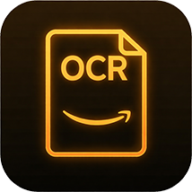
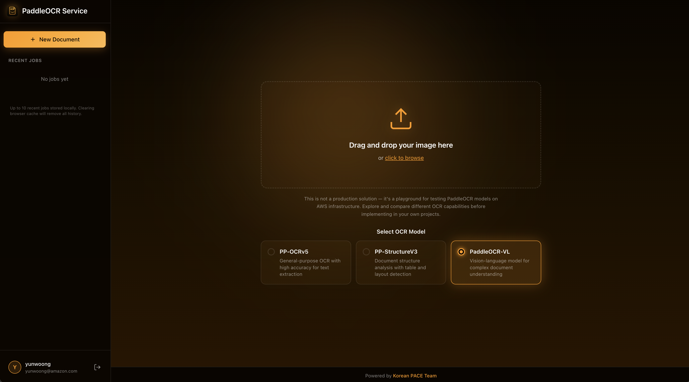
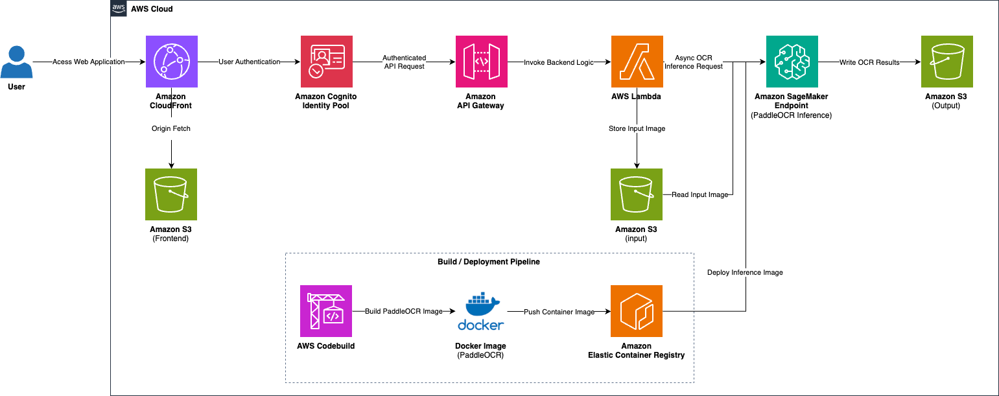

<p align="center">
  
</p>

<h1 align="center">OCR Vision Lab</h1>

<p align="center">
  <strong>AWS 인프라에서 여러 OCR / 비전-언어 모델을 테스트하고 비교하기 위한 서버리스 OCR 플레이그라운드</strong>
</p>

<p align="center">
  
  
  
  
  
  
  
  
  
  
  
</p>

<p align="center">
  <a href="../README.md">English</a> | <strong>한국어</strong> | <a href="README_ja.md">日本語</a>
</p>

<p align="center">
  <a href="demo.md"><strong>데모 보기</strong></a>
</p>

<p align="center">
  <a href="#기능">기능</a> |
  <a href="#아키텍처">아키텍처</a> |
  <a href="#시작하기">시작하기</a> |
  <a href="#배포">배포</a> |
  <a href="#지원-모델">모델</a>
</p>

---

## 개요

OCR Vision Lab은 AWS 인프라에서 **여러 OCR / 비전-언어 모델을 테스트하고 비교**할 수 있는 웹 기반 플레이그라운드입니다. 문서를 업로드해 여러 모델로 실행하고, 바운딩 박스 오버레이와 함께 결과를 나란히 비교할 수 있습니다. 현재 네 가지 모델 패밀리를 제공합니다: [PaddleOCR](https://github.com/PaddlePaddle/PaddleOCR), [Unlimited-OCR](https://huggingface.co/baidu/Unlimited-OCR), [GLM-OCR](https://huggingface.co/zai-org/GLM-OCR), [Qwen3-VL](https://github.com/QwenLM/Qwen3-VL).

> **참고**: 이것은 프로덕션 솔루션이 아닙니다 — AWS 인프라에서 OCR 모델을 테스트하고 비교하기 위한 플레이그라운드입니다. 실험, 평가 및 개발 목적으로 설계되었습니다.



## 기능

- **다중 모델 패밀리** (각자 별도의 SageMaker 엔드포인트)
  - **PaddleOCR** — `PP-OCRv5` (범용 텍스트), `PP-StructureV3` (테이블/레이아웃), `PaddleOCR-VL` (비전-언어)
  - **Unlimited-OCR** — Baidu 3B VLM, `gundam` (고정밀) / `base` (멀티페이지 PDF)
  - **GLM-OCR** — Zhipu 0.9B, 가볍고 빠름
  - **Qwen3-VL** — Alibaba `4B` / `8B`, 강력한 다국어 정확도
  - 같은 문서를 여러 모델로 실행하고 run 탭에서 결과를 비교

- **다국어 지원**: 한국어, 영어, 중국어, 일본어 등 80개 이상의 언어 지원

- **지원 파일 형식**: PNG, JPEG, TIFF, PDF (멀티페이지, 최대 100MB)

- **인터랙티브 결과 뷰어**
  - 상세 검사를 위한 확대/축소 및 이동 컨트롤
  - 바운딩 박스 오버레이 시각화 (PaddleOCR / Unlimited-OCR)
  - 다양한 출력 형식 (Markdown, HTML, JSON, Blocks)

- **GPU 비용 제어**: 모델별 전원 토글 — 엔드포인트는 기본적으로 꺼져 있고(오토스케일링 min 0) 유휴 시 0으로 스케일됩니다. 필요할 때만 사이드바에서 해당 모델을 켜세요

- **서버리스 아키텍처**: 자동 스케일링이 가능한 완전 관리형 AWS 인프라

## 아키텍처


### 구성 요소

| 구성 요소 | AWS 서비스 | 설명 |
|-----------|------------|------|
| 프론트엔드 | CloudFront + S3 | React 기반 웹 애플리케이션 |
| 인증 | Cognito | 사용자 인증 및 권한 부여 |
| API | API Gateway + Lambda | RESTful API 엔드포인트 + 엔드포인트 전원 토글 |
| OCR 엔진 | SageMaker 비동기 엔드포인트 | 모델 패밀리별 엔드포인트 1개 (PaddleOCR / Unlimited-OCR / GLM-OCR / Qwen3-VL 4B / Qwen3-VL 8B) |
| 스토리지 | S3 | 문서 저장 및 OCR 결과 |
| 컨테이너 | ECR + CodeBuild | 모델별 SageMaker용 Docker 이미지 |

### 워크플로우

1. 사용자가 Amazon Cognito를 통해 인증
2. React 프론트엔드를 통해 문서 업로드
3. 필요한 경우 선택한 모델의 엔드포인트를 켭니다 (확인 프롬프트, 오토스케일링 min 0 → 1)
4. API Gateway가 Lambda를 트리거하고, Lambda가 모델 패밀리에 맞는 엔드포인트로 라우팅
5. Lambda가 문서를 S3에 업로드하고 SageMaker 비동기 엔드포인트 호출
6. SageMaker가 추론 실행 (PDF는 페이지별 이미지로 분할)
7. 결과가 S3에 저장되고 프론트엔드가 폴링하여 시각적 오버레이와 함께 표시

## 시작하기

### 사전 요구 사항

- [mise](https://mise.jdx.dev/) (권장) 또는 수동 설치:
  - Node.js v22+, pnpm v10+, Python 3.12 (로컬 도구용), AWS CDK
  - 참고: Lambda 함수는 Python 3.14 런타임에서 실행되며, 로컬 3.12는 CDK/빌드 도구 체인용입니다.
- [AWS CLI](https://aws.amazon.com/cli/) (적절한 자격 증명으로 설정)

### 설치

```bash
# 저장소 복제
git clone https://github.com/yunwoong7/aws-ocr-vision-lab.git
cd aws-ocr-vision-lab

# mise로 도구 설치 (Node, pnpm, Python, CDK 자동 설치)
mise install

# 의존성 설치
pnpm install
```

### 로컬 개발

```bash
# 프론트엔드 개발 서버 시작
mise run dev
```

---

## 배포

### AWS CloudShell로 배포 (권장)

가장 쉬운 배포 방법은 AWS 자격 증명이 미리 구성된 AWS CloudShell을 사용하는 것입니다.

1. AWS 콘솔에서 [AWS CloudShell](https://console.aws.amazon.com/cloudshell/)을 엽니다

2. 저장소를 복제하고 배포 스크립트를 실행합니다:
```bash
git clone https://github.com/yunwoong7/aws-ocr-vision-lab.git
cd aws-ocr-vision-lab
chmod +x deploy.sh cleanup.sh
./deploy.sh
```

3. 스크립트가 다음을 묻습니다:
   - 관리자 이메일 주소 (Cognito용)
   - SageMaker 인스턴스 유형

4. 배포가 완료될 때까지 대기합니다 (~20-30분)

5. 마지막에 제공되는 애플리케이션 URL로 접속합니다

### 스택 구조

| 스택 | 설명 |
|------|------|
| **AwsOcrLab-Infra** | S3 버킷, 모델별 ECR 저장소, CodeBuild 프로젝트 |
| **AwsOcrLab-Model** | S3에 model.tar.gz로 패키징되는 모델 아티팩트 (inference.py) |
| **AwsOcrLab-Identity** | Cognito User Pool 및 Identity Pool |
| **AwsOcrLab-Endpoint** | PaddleOCR SageMaker 비동기 엔드포인트 |
| **AwsOcrLab-UnlimitedEndpoint** | Unlimited-OCR SageMaker 비동기 엔드포인트 |
| **AwsOcrLab-GlmEndpoint** | GLM-OCR SageMaker 비동기 엔드포인트 |
| **AwsOcrLab-Qwen4bEndpoint** / **-Qwen8bEndpoint** | Qwen3-VL 4B / 8B SageMaker 비동기 엔드포인트 |
| **AwsOcrLab-Api** | API Gateway + Lambda 함수 |
| **AwsOcrLab-Frontend** | CloudFront + S3 정적 웹사이트 |

> 모든 엔드포인트는 기본적으로 **꺼져** 있습니다 (오토스케일링 min 0). 유휴 시 0으로 스케일되고 앱 사이드바에서 켜기 때문에, 모델을 사용하는 동안의 GPU 시간에 대해서만 비용이 발생합니다.

### 수동 배포 (로컬)

로컬 머신에서 배포하려면:

```bash
# AWS 설정으로 .env.local 생성
echo "AWS_REGION=ap-northeast-2" > .env.local
echo "AWS_PROFILE=your-profile" >> .env.local

# 모든 스택 배포
mise run deploy

# 또는 특정 스택만 배포
mise run deploy:stack
```

### 비용 관리

엔드포인트는 GPU 인스턴스입니다 (`ml.g5.xlarge` ≈ 각 **$1.7/시간**). 흔한
"항상 켜져 있는" 청구를 피하기 위해, **모든 엔드포인트는 기본적으로 꺼져 있고**(오토스케일링 min 0)
유휴 시 0으로 스케일됩니다:

- 필요할 때만 앱 사이드바("Models (GPU)")에서 모델을 **켜세요** — 몇 분 안에 기동됩니다.
- 꺼진 모델에 OCR을 제출하면 먼저 켤지 묻는 프롬프트가 표시됩니다.
- 유휴 모델(min 0)은 자동으로 0으로 다시 스케일되며, 꺼져 있는 동안에는 비용이 발생하지 않습니다.

리소스를 완전히 제거하려면:
```bash
# SageMaker 엔드포인트만 삭제
./cleanup.sh --endpoint-only

# 모든 리소스 삭제
./cleanup.sh
```

### 환경 변수

`.env.local`에 설정합니다 (mise가 자동 로드):

| 변수 | 설명 |
|------|------|
| `AWS_REGION` | AWS 리전 |
| `AWS_PROFILE` | AWS CLI 프로필 이름 |

## 지원 모델

| 패밀리 | 변형 | 크기 | 바운딩 박스 | 비고 |
|--------|------|------|-------------|------|
| **PaddleOCR** | PP-OCRv5 | — | ✅ | 범용 텍스트, 80개 이상 언어, 방향/왜곡 보정 옵션 |
| | PP-StructureV3 | — | ✅ | 테이블 + 레이아웃 구조 분석 |
| | PaddleOCR-VL | — | ✅ | 복잡한 레이아웃을 위한 비전-언어 |
| **Unlimited-OCR** | gundam | 3B | ✅ | 고정밀 단일 이미지 (미세 텍스트용 크롭) |
| | base | 3B | ✅ | 균형 잡힌 단일 이미지 + 멀티페이지 PDF |
| **GLM-OCR** | glm-ocr | 0.9B | ❌ | 가볍고 빠름, 마크다운 텍스트만 |
| **Qwen3-VL** | qwen3-vl-4b | 4B | ❌ | 빠른 VL OCR, 강력한 다국어 정확도 |
| | qwen3-vl-8b | 8B | ❌ | 더 높은 품질의 VL OCR |

### PaddleOCR

- **PP-OCRv5** — 범용 텍스트 추출. 옵션: 언어 (80개 이상), 문서 방향 분류, 왜곡 보정, 텍스트 라인 방향.
- **PP-StructureV3** — 문서 구조 분석. 제목, 테이블(마크다운), 공간 정보가 포함된 텍스트 블록을 출력합니다.
- **PaddleOCR-VL** — 혼합 콘텐츠와 복잡한 레이아웃을 위한 비전-언어 모델.

### Unlimited-OCR (Baidu, 3B VLM)

문서 파싱 비전-언어 모델. `gundam`은 미세 텍스트를 위해 이미지를 크롭하고,
`base`는 단일 이미지와 멀티페이지 PDF를 처리합니다. 바운딩 박스는 모델의 레이아웃
마크업에서 파싱되므로 Blocks/Document 뷰와 오버레이가 동작합니다.

### GLM-OCR (Zhipu, 0.9B)

가벼운 멀티모달 OCR. 매우 빠르고 가볍지만 텍스트 전용이며(바운딩 박스 없음),
결과는 Markdown 뷰에서 렌더링됩니다.

### Qwen3-VL (Alibaba, 4B / 8B)

강력한 다국어(한국어 포함) 정확도를 가진 비전-언어 OCR. 현재는 텍스트 전용
출력이며(바운딩 박스 없음), 4B는 더 빠르고 8B는 더 높은 품질을 제공합니다.

## 프로젝트 구조

```
aws-ocr-vision-lab/
├── .mise.toml               # 도구 버전 & 태스크 (mise)
├── .env.local                # AWS 프로필 & 리전 (git-ignored)
├── packages/
│   ├── frontend/             # React 웹 애플리케이션
│   │   └── src/
│   │       ├── components/
│   │       │   ├── OcrPage/    # 결과 뷰어 컴포넌트
│   │       │   ├── AppLayout/  # 앱 셸 & 사이드바
│   │       │   └── DocumentEditor/
│   │       ├── hooks/          # 커스텀 React 훅
│   │       ├── utils/          # PDF & OCR 헬퍼 유틸리티
│   │       ├── routes/         # 페이지 라우트
│   │       └── types/          # TypeScript 타입
│   ├── infra/                # AWS CDK 인프라
│   │   ├── src/stacks/         # CDK 스택 정의
│   │   ├── src/dockerfiles.ts  # 모델별 컨테이너 Dockerfile
│   │   ├── lambda/             # Lambda 함수 (Python)
│   │   ├── layers/             # Lambda 레이어 (DuckDB)
│   │   └── model/              # 패밀리별 SageMaker 추론 코드
│   │       ├── code/             # PaddleOCR
│   │       ├── unlimited/        # Unlimited-OCR
│   │       ├── glm/              # GLM-OCR
│   │       └── qwen/             # Qwen3-VL (4B/8B 공유)
│   └── common/constructs/   # 공유 CDK 구성 요소
├── docs/                     # 문서
└── README.md
```

## 기술 스택

- **프론트엔드**: React 19, TypeScript, Vite
- **백엔드**: Python 3.14 (Lambda), DuckDB
- **모델**: PaddleOCR, Unlimited-OCR, GLM-OCR, Qwen3-VL (SageMaker 상의 Hugging Face Transformers)
- **인프라**: AWS CDK (TypeScript)
- **빌드 시스템**: Nx Monorepo, mise
- **AWS 서비스**: CloudFront, S3, API Gateway, Lambda, SageMaker, Cognito, ECR, CodeBuild, Application Auto Scaling

## 라이선스

이 프로젝트는 [MIT 라이선스](../LICENSE)에 따라 라이선스가 부여됩니다.
