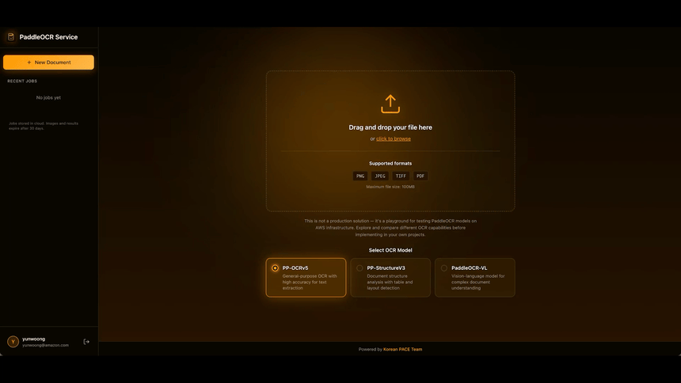
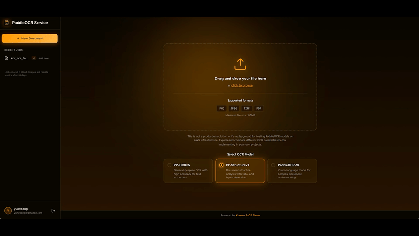

# OCR Vision Lab Demo

This document showcases the three OCR models available in OCR Vision Lab, along with their options and use cases.

---

## OCR Models

### 1. PP-OCRv5

**General-purpose OCR optimized for high-accuracy text extraction.**

PP-OCRv5 is PaddlePaddle's latest OCR model, providing excellent accuracy for extracting text from images and documents. It supports 80+ languages and is ideal for straightforward text extraction tasks.

#### Options

| Option | Description |
|--------|-------------|
| **Language** | Select the primary language of the document. Supports 80+ languages including Korean, English, Chinese, Japanese, and more. |
| **Document Orientation Classification** | Automatically detects and corrects rotated documents (0°, 90°, 180°, 270°). Enable for scanned documents that may be rotated. |
| **Document Unwarping** | Corrects perspective distortion and curvature in photographed documents. Useful for photos of curved book pages or documents taken at an angle. |
| **Text Line Orientation** | Detects text direction within each line. Enable for documents with mixed horizontal and vertical text. |

#### Best For
- Standard documents with clear text
- Multi-language documents
- Documents with simple layouts
- High-accuracy text extraction

---

### 2. PP-StructureV3

**Advanced document structure analysis with layout understanding.**

PP-StructureV3 goes beyond simple text extraction to understand document structure. It detects and categorizes different elements like titles, paragraphs, tables, figures, and more, preserving the logical structure of your documents.

#### Options

| Option | Description |
|--------|-------------|
| **Language** | Select the primary language for text recognition within detected blocks. |
| **Document Orientation Classification** | Automatically corrects rotated documents before structure analysis. |
| **Document Unwarping** | Corrects perspective distortion for better layout detection accuracy. |

#### Detected Layout Elements

PP-StructureV3 can detect and classify 20 different layout categories:

| Category | Description |
|----------|-------------|
| `doc_title` | Document main title |
| `paragraph_title` | Section/paragraph headings |
| `text` | Regular text blocks |
| `number` | Numbered items |
| `abstract` | Document abstracts |
| `table` | Tables (extracted as Markdown) |
| `references` | Reference/citation sections |
| `footnotes` | Footnotes |
| `header` | Page headers |
| `footer` | Page footers |
| `algorithm` | Algorithm blocks |
| `formula` | Mathematical formulas |
| `formula_number` | Formula numbering |
| `image` | Images/photos |
| `seal` | Stamps/seals |
| `figure_title` | Figure captions |
| `chart` | Charts and graphs |
| `sidebar` | Sidebar content |
| `picture` | Pictures/illustrations |
| `stamp` | Stamps |

#### Best For
- Complex documents with mixed content
- Documents with tables
- Academic papers and reports
- Documents requiring structure preservation

---

### 3. PaddleOCR-VL (Vision-Language)

**Vision-language model for complex document understanding.**

PaddleOCR-VL combines visual understanding with language processing, making it ideal for documents where context matters. It can understand the relationship between visual elements and text, providing more intelligent extraction results.

#### Options

This model has no configurable options. It uses end-to-end vision-language processing to analyze documents holistically.

#### Best For
- Mixed content documents (text + images + charts)
- Documents requiring contextual understanding
- Complex layouts with interrelated elements
- Documents where visual context affects meaning

---

## Output Formats

All models support multiple output formats:

| Format | Description |
|--------|-------------|
| **Markdown** | Structured text output with formatting preserved |
| **HTML** | Rich HTML output for web display |
| **JSON** | Raw structured data for programmatic access |
| **Blocks** | Visual block view with bounding boxes and cropped images |

---

## Quick Comparison

| Feature | PP-OCRv5 | PP-StructureV3 | PaddleOCR-VL |
|---------|----------|----------------|--------------|
| Text Extraction | Excellent | Good | Good |
| Layout Detection | - | Excellent | Good |
| Table Extraction | - | Excellent | Good |
| Language Options | 80+ languages | 80+ languages | Auto |
| Orientation Fix | Yes | Yes | Auto |
| Unwarping | Yes | Yes | - |
| Contextual Understanding | - | - | Excellent |
| Processing Speed | Fast | Medium | Slower |

---

## Tips for Best Results

1. **Choose the right model**: Use PP-OCRv5 for simple text, PP-StructureV3 for structured documents, and PaddleOCR-VL for complex layouts.

2. **Enable orientation classification**: If your document might be rotated, enable this option for automatic correction.

3. **Use unwarping for photos**: When working with photographed documents (not scans), enable document unwarping for better results.

4. **Select the correct language**: Even though models can detect multiple languages, selecting the primary language improves accuracy.

5. **Use the Retry feature**: After viewing results, you can retry the same image with different options to compare model performance.
